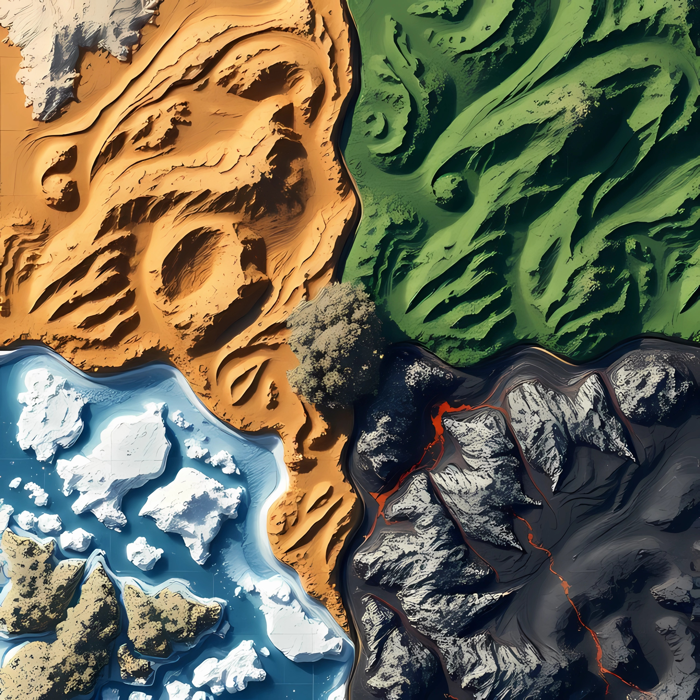

## ¡¡Salva a los dinosaurios de la extinción!!

> Juego de mesa y de cartas colaborativo

#### Tablero:
> cuatro cuadrantes, cada uno con un ecosistema - Desierto, Jungla, Volcán, Hielo.

#### Cómo se juega:
Se juega con una baraja de cartas de dinosaurios y una baraja de cartas de eventos.  
  
Es un juego colaborativo, pero no podemos desvelar nuestras cartas al resto de jugadores.  
  
La partida termina cuando los eventos catastróficos extinguen a todas las especies de dinosaurio. El objetivo es salvar a los dinosaurios de la extinción el mayor tiempo posible.  
  
Los jugadores empiezan sin cartas. En su turno, roban una carta y pueden jugar las cartas de dinosaurio que deseen. Al jugar una carta de dinosaurio, se coloca la carta de dinosaurio en la casilla de incubación indicada, como cuenta atrás hasta la eclosión del huevo, y se coloca el huevo de dinosaurio en su ecosistema correspondiente. Si el dinosaurio tiene varios ecosistemas válidos, el jugador elige en cuál de ellos colocar el huevo. Al extinguirse uno o más dinosaurios, y/o perderse uno o más huevos, se colocan las cartas de dinosaurio correspondientes en el orden que los jugadores elijan detrás del mazo de dinosaurios.  

#### Cada ronda:
- Avanzan los contadores de incubación.
- Nacen los dinosaurios que han terminado su incubación.
- Se juega una carta de evento (Los primeros 5 turnos están exentos). Si no quedan eventos, ganamos la partida.
- Si todos los dinosaurios se han extinguido y todos los huevos se han perdido, termina la partida.
- Cada jugador juega su turno

#### Cada turno:
- Se ejecutan acciones disponibles, como las migraciones, en cualquier orden elegido.
- Si hubiera dinosaurios en el desierto, se extingue uno.
- Si hubiera dinosaurios en el hielo, se extingue uno.
- Si hubiera dinosaurios en la jungla, se añade el huevo correspondiente a la siguiente carta de dinosaurio de la baraja.

#### Cartas de evento:
- (x3) Migración masiva: Los jugadores pueden mover cualquier dinosaurio a cualquier ecosistema.
- (x2) Meteorito: Se extinguen todos los dinosaurios excepto los voladores y los acuáticos.
- (x3) Edad de hielo: Se extinguen todos los dinosaurios que no tienen el hielo como ecosistema. Se pierden los huevos con más de dos rondas de incubación pendiente.
- (x3) Sequía: Se extinguen todos los dinosaurios que no tienen el desierto como ecosistema. Se pierden los huevos a punto de eclosionar.
- (x5) Explosión cámbrica: Todos los jugadores roban una carta de dinosaurio.
- (x5) Incendio: Se extinguen todos los dinosaurios de la jungla excepto los acuáticos. Se pierden todos los huevos de la jungla excepto los acuáticos.
- (x5) Erupción volcánica: Se extinguen todos los dinosaurios del volcán excepto los acuáticos. Se pierden todos los huevos del volcán.
- (x3) Sobrepoblación: Se extinguen todos los dinosaurios del ecosistema con más dinosaurios.
- (x3) Se extinguen tres dinosaurios en la jungla.
- (x3) Plaga: Se extinguen todos los dinosaurios acuáticos y voladores. Se extingue al menos un dinosaurio de cada ecosistema.
- (x5) Terremoto: Todos los huevos se pierden. Todos los dinosaurios deben migrar a un ecosistema adyacente.
- (x2) Epigenética: Sin alterar su orden, desvela las tres siguientes cartas de evento. Los jugadores pueden desvelar sus cartas y discutir estrategias.
- (x5) Superviviente: La partida no puede terminar esta ronda. Juega la siguiente carta de evento de la baraja, pero continúa jugando aunque todos los dinosaurios se extingan y todos los huevos se pierdan.

#### Cartas de dinosaurio:

<link href="https://cdn.jsdelivr.net/npm/bootstrap@5.3.0-alpha1/dist/css/bootstrap.min.css" rel="stylesheet">

         

           

             <h1 style="font-size: 250px; text-align: center;">🦕</h1>
           

           

             

Plesiosaurio               

               
             

           

           

             

Plesiosaurio del oasis               

               
             

           

           

             

Maiasaura               

               
             

           

           

             

Anquilosaurio               

               
             

           

           

             

Minmi               

               
             

           

           

             

Diplodocus verde               

               
             

           

           

             

Diplodocus rocoso               

               
             

           

           

             

Diplodocus blanco               

               
             

           

           

             

Pterosaurio               

               
             

           

           

             

Pterodáctilo               

               
             

           

           

             

Utahraptor               

               
             

           

           

             

Estiracosaurio               

               
             

           

           

             

Herrerasaurio               

               
             

           

           

             

Edmontosaurio               

               
             

           

           

             

Tarquia               

               
             

           

           

             

Microraptor               

               
             

           

           

             

Camarasauro               

               
             

           

           

             

Compsognathus               

               
             

           

           

             

Paquicefalosaurio               

               
             

           

           

             

Estegosaurio naranja               

               
             

           

           

             

Estegosaurio violeta               

               
             

           

           

             

Iguanodón               

               
             

           

           

             

Parasaurolophus               

               
             

           

           

             

Velociraptor               

               
             

           

           

             

Velociraptor mini               

               
             

           

           

             

Saurópodo               

               
             

           

           

             

Huayangosaurio               

               
             

           

           

             

Paquirrinosaurio               

               
             

           

           

             

Espinosaurio               

               
             

           

           

             

Protoceratops caramelo               

               
             

           

           

             

Protoceratops rosita               

               
             

           

           

             

Triceratops               

               
             

           

         

       

