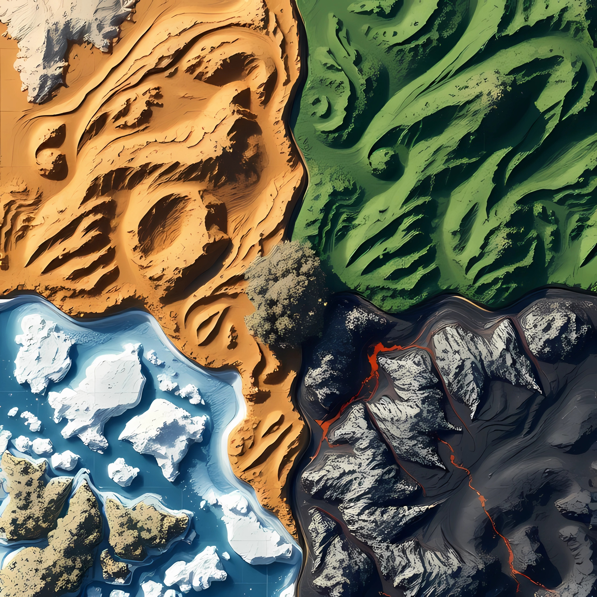

## ¡¡Salva a los dinosaurios de la extinción!!

> Juego de mesa y de cartas colaborativo

#### Tablero:  
> cuatro cuadrantes, cada uno con un ecosistema - Desierto, Jungla, Volcán, Hielo.

#### Cómo se juega:  
Se juega con una baraja de cartas de dinosaurios y una baraja de cartas de eventos.  
  
Es un juego colaborativo, pero no podemos desvelar nuestras cartas al resto de jugadores.  
  
La partida termina cuando los eventos catastróficos extinguen a todas las especies de dinosaurio. El objetivo es salvar a los dinosaurios de la extinción el mayor tiempo posible.  
  
Los jugadores empiezan sin cartas. En su turno, el jugador roba una carta (dos cartas para pocos jugadores o menor dificultad), y puede jugar las cartas de dinosaurio que desee. Al jugar una carta de dinosaurio, colocaremos un huevo en su ecosistema correspondiente (Si el dinosaurio tiene varios ecosistemas válidos, el jugador elige en cuál de ellos colocar el huevo). Tendremos que esperar el número de turnos indicado por el marcador de incubación de la carta hasta la eclosión del huevo. Al eclosionar el huevo, este se retira del tablero, y se coloca en su lugar la carta de dinosaurio. Al extinguirse uno o más dinosaurios, y/o perderse uno o más huevos, se colocan las cartas de dinosaurio correspondientes en el orden que los jugadores elijan detrás del mazo de dinosaurios.

#### Cada ronda:  
- Avanzan los contadores de incubación.
- Nacen los dinosaurios que han terminado su incubación.
- Se juegan dos cartas de evento, por el orden que los jugadores elijan (Los primeros 5 turnos están exentos).
- Si todos los dinosaurios se han extinguido y todos los huevos se han perdido, termina la partida.
- Cada jugador juega su turno

#### Cada turno:  
- Se ejecutan acciones disponibles, como las migraciones, en cualquier orden elegido.
- Si hubiera dinosaurios en el desierto, se extingue uno.
- Si hubiera dinosaurios en el hielo, se extingue uno.
- Si hubiera dinosaurios en la jungla, se añade a la jungla el huevo correspondiente a la siguiente carta de dinosaurio de la baraja, aunque su ecosistema no sea la jungla.

#### Cartas de evento:  
- (x3) Migración masiva: Los jugadores pueden mover cualquier dinosaurio a cualquier ecosistema.
- (x2) Meteorito: Se extinguen todos los dinosaurios excepto los voladores y los acuáticos.
- (x3) Edad de hielo: Se extinguen todos los dinosaurios que no tienen el hielo como ecosistema. Se pierden los huevos con más de dos rondas de incubación pendiente.
- (x3) Sequía: Se extinguen todos los dinosaurios que no tienen el desierto como ecosistema. Se pierden los huevos a punto de eclosionar.
- (x5) Explosión cámbrica: Todos los jugadores roban una carta de dinosaurio.
- (x5) Incendio: Se extinguen todos los dinosaurios de la jungla excepto los acuáticos. Se pierden todos los huevos de la jungla excepto los acuáticos.
- (x5) Erupción volcánica: Se extinguen todos los dinosaurios del volcán excepto los acuáticos. Se pierden todos los huevos del volcán.
- (x3) Sobrepoblación: Se extinguen todos los dinosaurios del ecosistema con más dinosaurios.
- (x3) Escasez: Se extinguen tres dinosaurios en la jungla y un dinosaurio del resto de ecosistemas.
- (x3) Plaga: Se extinguen todos los dinosaurios acuáticos y voladores. Se extingue al menos un dinosaurio de cada ecosistema.
- (x5) Terremoto: Todos los huevos se pierden. Todos los dinosaurios deben migrar a un ecosistema adyacente.
- (x2) Epigenética: Sin alterar su orden, desvela las tres siguientes cartas de evento. Los jugadores pueden desvelar sus cartas y discutir estrategias.
- (x5) Superviviente: La partida no puede terminar esta ronda. Juega la siguiente carta de evento de la baraja, pero continúa jugando aunque todos los dinosaurios se extingan y todos los huevos se pierdan.

#### Cartas de dinosaurios fantásticos:  
  
**Plesiosaurio**:  
Incubación: 5  
Ecosistemas: 'jungla', 'hielo'  
Acuático. El jugador que juega la carta de Plesiosaurio puede mostrar sus cartas al resto de jugadores.  
  
**Plesiosaurio del oasis**:  
Incubación: 5  
Ecosistemas: 'desierto'  
Acuático. Elimina la extinción automática en el desierto cada ronda.  
  
**Maiasaura**:  
Incubación: 3  
Ecosistemas: 'jungla'
Protege todos los huevos del tablero. Permite eclosionar huevos una ronda antes de tiempo.  
  
**Anquilosaurio**:  
Incubación: 5  
Ecosistemas: 'jungla', 'hielo'  
Cuando el huevo de Anquilosaurio eclosiona, roba una carta.  
  
**Minmi**:  
Incubación: 1  
Ecosistemas: 'desierto'  
Al final de la ronda, puede migrar al origen de otra migración ocurrida este turno.  
  
**Diplodocus verde**:  
Incubación: 5  
Ecosistemas: 'jungla'  
En caso de incendio, sobreviven hasta tres dinosarios distintos al diplodocus verde.  
  
**Diplodocus rocoso**:  
Incubación: 4  
Ecosistemas: 'volcán'  
En caso de erupción volcánica, sobreviven hasta dos dinosarios distintos al diplodocus rocoso.  
  
**Diplodocus blanco**:  
Incubación: 6  
Ecosistemas: 'hielo'  
Protege a todos los dinosaurios de la jungla de la edad de hielo.  
  
**Pterosaurio**:  
Incubación: 2  
Ecosistemas: 'hielo', 'desierto'  
Vuela, migra instantáneamente al hielo o al desierto.  
  
**Pterodáctilo**:  
Incubación: 2  
Ecosistemas: 'jungla'  
Vuela, migra instantáneamente con la condición de extinguir un dinosaurio en el ecosistema de destino.  
  
**Utahraptor**:  
Incubación: 4  
Ecosistemas: 'volcán'  
Puede unirse a la migración de otro dinosaurio de su ecosistema.  
  
**Estiracosaurio**:  
Incubación: 3  
Ecosistemas: 'jungla'  
Puede migrar a cualquier ecosistema vacío al final de la ronda.  
  
**Herrerasaurio**:  
Incubación: 4  
Ecosistemas: 'jungla'  
Cada turno, otro dinosaurio de su ecosistema migra al volcán huyendo del herrerasaurio.  
  
**Edmontosaurio**:  
Incubación: 5  
Ecosistemas: 'hielo'  
Puede migrar al final de la ronda, intercambiando su posición con otro dinosaurio.  
  
**Tarquia**:  
Incubación: 7  
Ecosistemas: 'volcán'  
El huevo de Tarquia protege a todos los huevos de erupciones volcánicas.  
  
**Microraptor**:  
Incubación: 1  
Ecosistemas: 'jungla', 'desierto'  
Invulnerable a la extinción automática en el desierto (no protege a otros).  
  
**Camarasauro**:  
Incubación: 7  
Ecosistemas: 'hielo'  
Elimina la extinción automática en el hielo.  
  
**Compsognathus**:  
Incubación: 1  
Ecosistemas: 'volcán', 'desierto'  
Puede migrar al final de la ronda, si intercambia su posición con un huevo de dinosaurio.  
  
**Paquicefalosaurio**:  
Incubación: 3  
Ecosistemas: 'jungla'  
Ladrón de huevos. Puede migrar al final de la ronda, si lleva con él al menos dos huevos de su ecosistema al ecosistema de destino.  Su extinción protege a todos los huevos de su ecosistema hasta la siguiente ronda.  
  
**Estegosaurio naranja**:  
Incubación: 5  
Ecosistemas: 'jungla', 'volcán'  
Permite poner huevos naturales de la jungla en el volcán.  
  
**Estegosaurio violeta**:  
Incubación: 5  
Ecosistemas: 'jungla', 'hielo'  
Permite poner huevos naturales de la jungla en el hielo.  
  
**Iguanodón**:  
Incubación: 4  
Ecosistemas: 'volcán', 'desierto'  
Permite poner cualquier huevo en el ecosistema donde está el iguanodón.  
  
**Parasaurolophus**:  
Incubación: 6  
Ecosistemas: 'volcán', 'jungla'  
Puede migrar al instante al volcán o la jungla, con el coste de devorar un dinosaurio en el nuevo ecosistema.  
  
**Velociraptor**:  
Incubación: 2  
Ecosistemas: 'jungla'  
Puede migrar instantáneamente, devorando a un dinosaurio fuera de su ecosistema. Vuelve a su ecosistema de origen al final del turno.  
  
**Velociraptor mini**:  
Incubación: 1  
Ecosistemas: 'jungla'  
Puede migrar instantáneamente, devorando un huevo fuera de su ecosistema. Vuelve a su ecosistema de origen al final del turno.  
  
**Saurópodo**:  
Incubación: 3  
Ecosistemas: 'desierto', 'hielo'  
Puede migrar a cualquier ecosistema al final de la ronda. Cuando se extingue, el jugador que jugó la carta de Saurópodo roba una carta.  
  
**Huayangosaurio**:  
Incubación: 4  
Ecosistemas: 'volcán', 'desierto'  
No puede ser devorado por otros dinosaurios. Cuando se extingue, el jugador que jugó la carta de Huayangosaurio roba una carta.  
  
**Paquirrinosaurio**:  
Incubación: 3  
Ecosistemas: 'hielo', 'volcán'  
Su extinción protege a todos los dinosaurios de su ecosistema hasta la siguiente ronda.  
  
**Espinosaurio**:  
Incubación: 2  
Ecosistemas: 'jungla'  
Puede devorar instantáneamente a otro dinosaurio. El jugador que jugó el dinosaurio devorado roba una carta.  
  
**Protoceratops caramelo**:  
Incubación: 3  
Ecosistemas: 'desierto'  
El jugador que juegue la carta de protoceratops caramelo levanta las siguientes cinco cartas del mazo de dinosaurios, y las coloca en la parte superior o inferior del mazo en cualquier orden.  
  
**Protoceratops rosita**:  
Incubación: 3  
Ecosistemas: 'volcán'  
El jugador que juegue la carta de protoceratops rosita levanta las siguientes cinco cartas del mazo de dinosaurios, y las coloca en la parte superior o inferior del mazo en cualquier orden.  
  
**Triceratops**:  
Incubación: 4  
Ecosistemas: 'jungla'  
Su extinción protege a otro dinosaurio hasta la siguiente ronda.  